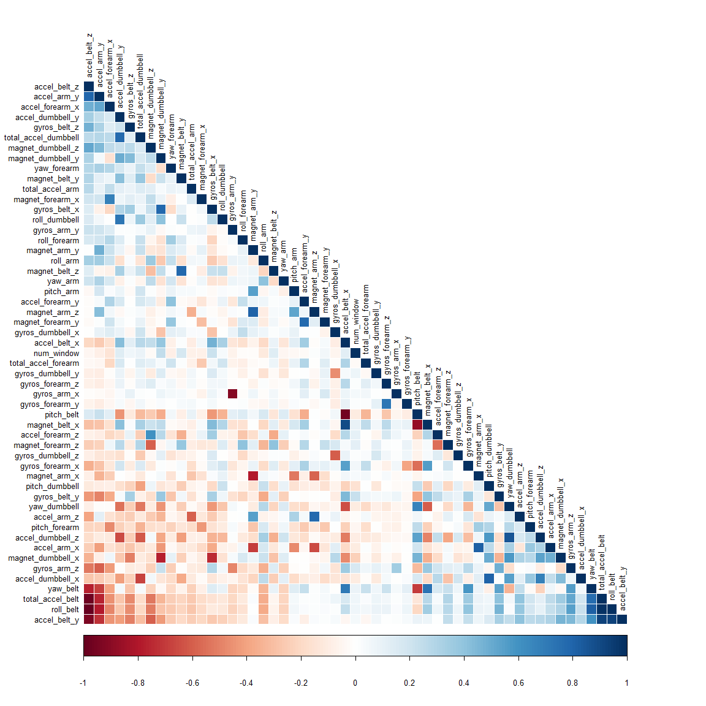

# Making Predictions Using Personal Activity Tracking Data
Seah Kah Tat

### Objective

The objective of this project is to predict the classification of barbell lifts performed using data collected from accelerometers attached to the belt, forearm, arm, and dumbell during the exercises. The information is available from the website here: [http://groupware.les.inf.puc-rio.br/har](http://groupware.les.inf.puc-rio.br/har) (see the section on the Weight Lifting Exercise Dataset).

### Data

The training data for this project are available here:

[https://d396qusza40orc.cloudfront.net/predmachlearn/pml-training.csv](https://d396qusza40orc.cloudfront.net/predmachlearn/pml-training.csv)

The test data are available here:

[https://d396qusza40orc.cloudfront.net/predmachlearn/pml-testing.csv](https://d396qusza40orc.cloudfront.net/predmachlearn/pml-testing.csv)

### Exploratory Data Analysis

First, load the data using the code:


```r
adData <- read.csv(paste(getwd(), "/pml-training.csv", sep = ""))
evaluation <- read.csv(paste(getwd(), "/pml-testing.csv", sep = ""))
```

Next, partition `adData` into training and testing sets with a ratio of 6:4 for the purpose of conducting cross-validation for the prediction model:


```r
library(caret)
inTrain <- createDataPartition(adData$classe, p = 0.6)[[1]]
training <- adData[ inTrain,]
testing <- adData[-inTrain,]
```

A brief look at the dataset contents using `str(evaluation)` reveals 160 variables, including the first six timestamp, identity and other variables not useful for prediction modelling. More importantly the observations record `NA` in most of the variables. We can thus reduce the training data size to contain only the variables found in the evaluation set and use that to train our prediction model. This can be done using the following code:


```r
eval2 <- evaluation[,colSums(is.na(evaluation)) == 0]
train2 <- training[,names(training) %in% colnames(eval2)]
train2 <- cbind(classe=training$classe, train2) # restore outcome variable in reduced dataset
```

To help us analyse the data, we look at the correlation between each pair of variables so as to remove highly correlated predictors from our analysis. However, as there are 53 variables to be considered, we can capture these information more concisely by representing them using a coloured grid with the following code:


```r
library(corrplot)
corMat <- cor(train2[,-c(1:7)]) # exclude first 7 variables including 'classe'
corrplot(corMat, order = "FPC", method = "color", type = "lower", tl.cex = 0.8, tl.col = rgb(0, 0, 0))
```

 

The grid shows many instances of highly positive and highly negative correlations spread over multiple variables. As such, it would be more feasible to perform principal component analysis to produce a set of linearly correlated variables to be used as predictors for the prediction model.

### Principal Component Analysis and Building the Prediction Model

Principal component analysis was applied to `train2` dataset, the cleaned version of training dataset, to obtain a preprocessed dataset consisting of only linearly correlated variables. The number of these variables is determined by setting the desired threshold in the `preProcess` function. The threshold was set to be 80% so as to balance between maintaining a small set of variables and keeping a reasonable accuracy for the resulting prediction model. A new set of data based on the new predictors, `trainPC`, was then predicted from the `train2` dataset. The resulting code is as follow:


```r
preProc <- preProcess(train2[,-c(1:7)], method="pca", thresh = 0.8, outcome = train2$classe)
trainPC <- predict(preProc, train2[,-c(1:7)])
```

### Cross-Validation and Out-of-sample Error

We can now fit a predictive model to the resulting dataset using the `train` function and the choice of classification method is the random forest. As cross-validation by bootstraping requires much more computation time, k-fold random sampling with k=3 was used instead. 


```r
modelFit <- train(train2$classe ~ ., method = "rf", data = trainPC, trControl = trainControl(allowParallel = TRUE, method = "cv", number = 3), importance = TRUE)
```

The resulting prediction model was then used to predict the outcome in the testing set and the accuracy results stored using `confusionMatrix` function:


```r
testPC <- predict(preProc, testing)
cm <- confusionMatrix(testing$classe, predict(modelFit, testPC))
```

The estimated accuracy and out-of-sample error for the model is:


```r
# Accuracy of model
cm$overall[[1]]
```

```
## [1] 0.9668621
```


```r
# Out-of-sample error
1 - cm$overall[[1]]
```

```
## [1] 0.0331379
```

### Final Prediction

Finally, we run the model on the evaluation dataset to obtain our predictions.


```r
evalPC <- predict(preProc, evaluation)
predict(modelFit, evalPC)
```

```
##  [1] B A B A A E D B A A B C B A E E A B B B
## Levels: A B C D E
```
